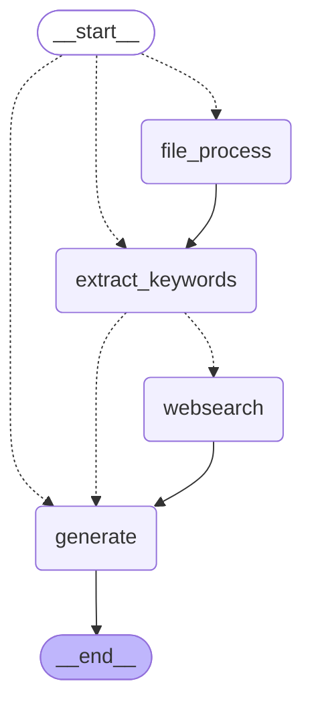

## 简介

LangGraphChatBot 是基于 LangChain 和 LangGraph 的 AI 聊天机器人，可以用于回答问题、生成文章、联网搜索、处理文件等。该应用具备以下功能：

1. 根据对话类型将请求路由到适当的处理节点
2. 支持联网搜索（基于 Tavily API），获取实时信息
3. 根据问题和对话历史生成优化的搜索提示词，优化搜索精度
4. 利用编程专用的 LLM 解决代码相关问题，支持连续对话、支持流式回答展示
5. 支持文件上传与 RAG 处理，切分文档，转换为向量表示，基于提供的文档内容和用户提问，总结生成答案
6. TODO: 多个 LLM 基座模型及 Embedding 模型可供选择，支持在线调节模型参数
7. TODO: 接入第三方工具，如天气、翻译等，支持更多功能
8. TODO: 当前联网搜索链路回复较慢，优化响应时间


## 快速开始

以下指南将帮助你在本地机器上安装和运行该项目，进行本地对话。

1. 克隆仓库

	```bash
	git clone git@github.com:kdjlyy/LangGraphChatBot.git
	cd LangGraphChatBot
	```

2. 安装依赖

	本项目推荐使用 uv 管理虚拟环境和依赖，如果没有安装 uv 也可以使用项目根目录下的 [requirements.txt](./requirements.txt) 文件拉取相关依赖。uv 的安装使用方法如下：

	```bash
	# 安装 uv
	pip install uv
	# 查看 uv 版本
	uv --version
	# 创建虚拟环境
	uv venv
	# 激活虚拟环境
	source .venv/bin/activate
	# 安装依赖
	uv sync
	```
	
	拉取 `python` 和 `torch` 相关包时可能会遇到网络问题，可以尝试使用国内源。
	
3. 项目配置

	项目从根目录的 `.env` 文件读取配置信息，包括模型路径、模型参数、API 密钥等。如果需要修改配置信息，可以修改 `.env` 文件，也可以在运行时通过命令行参数指定配置信息。相关配置项的描述详见：[.env.example](./.env.example) 文件注释。

	```bash
	# 创建 .env 文件
	cp .env.example .env
	```

4. 控制台运行项目

	```bash
	# 运行项目
	uv run main.py
	```

	现在你可以在控制台输入问题，等待模型返回结果。

5. 使用 Streamlit 运行项目

	```bash
	# 运行项目
	streamlit run app.py
	```

## 项目结构

项目的主要目录结构如下：

```
.
├── chains  		# 智能体
│   ├── generate.py
│   ├── models.py
│   └── summary.py
├── graph   		# 图结构
│   ├── graph.py
│   └── graph_state.py
├── upload_files    # 上传的文件
│   └── example.txt
├── utils
│   └── common.py 	# 工具
├── .env   			# 环境变量配置
├── .env.example	# 环境变量配置示例
├── app.py 			# Streamlit 应用
├── main.py			# 命令行程序
├── requirements.txt 	# 依赖
├── pyproject.toml 		# 项目配置
├── uv.lock			# uv 锁文件
├── run.sh			# 部署脚本
└── README.md 		# 项目说明
```
其中：

- [models.py](./chains/models.py) 文件负责根据提供的模型名称加载相应的模型
- [summary.py](./chains/summary.py) 用于从用户问题和聊天记录中提取关键词，并生成高效的搜索查询
- [generate.py](./chains/generate.py) 用于根据用户问题和聊天记录生成答案
- [graph_state.py](./graph/graph_state.py) 用于维护图结构的状态
- [graph.py](./graph/graph.py) 定义了多个方法，表示图的结构和行为，用于处理不同类型的请求

项目搭建的工作流如下：



## 其他

**NOTE:** 项目支持解析 `pdf`、`word`、`xlsx` 等其他格式的文件，但是由于部署服务器调用 `pytorch` 和 `cuda` 的内存不足目前仅支持解析 `txt` 和 `md` 文件，可以在 [app.py](./app.py) 中修改 `file_uploader` 的参数支持其他格式的文件。  

---

更多 Agent 项目介绍请参考：[Agent](https://github.com/kdjlyy/Agent)。


