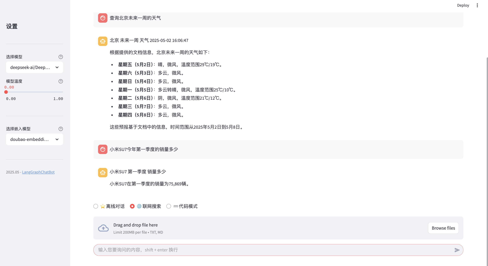
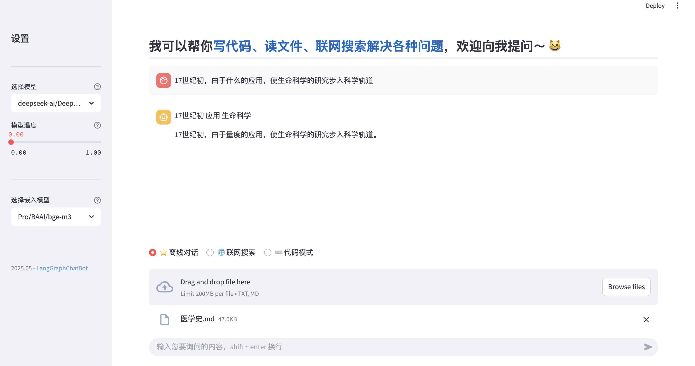

## 🎉 News

- [x] [2025.05.02] 🎯📢可自定义网页搜索返回的网页数量；用户查询关键字提取逻辑优化；向量召回后添加 rerank 操作。
- [x] [2025.04.29] 🎯📢现已接入火山方舟（ARK），支持选择`doubao-embedding-text-240715`和`doubao-embedding-large-text-240915`
Embedding 模型，分别对应 2560 和 4096 向量维度。

---

## 简介

> 项目效果展示: [LangGraphChatBot](http://14.103.121.86:8090/)
> <table>
> <tr>
> <td style="text-align: center;"></td>
> <td style="text-align: center;"></td>
> </tr>
> </table>

LangGraphChatBot 是基于 LangChain 和 LangGraph 的 AI 聊天机器人，可以用于回答问题、生成文章、联网搜索、处理文件等。该应用具备以下功能：

1. 根据对话类型将请求路由到适当的处理节点
2. 支持联网搜索（基于 `Tavily API`），获取实时信息
3. 根据问题和对话历史生成优化的搜索提示词，优化搜索精度
4. 利用编程专用的 `LLM` 解决代码相关问题，支持连续对话、支持流式回答展示
5. 支持文件上传与 `RAG` 处理，切分文档，转换为向量表示，基于提供的文档内容和用户提问，进行相似度搜索和 `rerank` 优化，总结生成答案
6. 多个 `LLM` 基座模型及 `Embedding` 模型可供选择，支持在线调节模型参数
7. `TODO:` 接入第三方工具，如天气、翻译等，支持更多功能
8. `TODO:` 当前联网搜索链路回复较慢，优化响应时间

> 🎉 更多 Agent 个人项目请参考：[Agent](https://github.com/kdjlyy/Agent)

## 快速开始

以下指南将帮助你在本地机器上安装和运行该项目，进行本地对话。

1. 克隆仓库

	```bash
	git clone git@github.com:kdjlyy/LangGraphChatBot.git
	cd LangGraphChatBot
	```

2. 安装依赖

	本项目推荐使用 uv 管理虚拟环境和依赖，如果没有安装 uv 也可以使用项目根目录下的 [requirements.txt](./requirements.txt) 文件拉取相关依赖。uv 的安装使用方法如下：

	```bash
	# 安装 uv
	pip install uv
	# 查看 uv 版本
	uv --version
	# 创建虚拟环境
	uv venv
	# 激活虚拟环境
	source .venv/bin/activate
	# 安装依赖
	uv sync
	```
	
	拉取 `python` 和 `torch` 相关包时可能会遇到网络问题，可以尝试使用国内源。
	
3. 项目配置

	项目从根目录的 `.env` 文件读取配置信息，包括模型路径、模型参数、API 密钥等。如果需要修改配置信息，可以修改 `.env` 文件，也可以在运行时通过命令行参数指定配置信息。相关配置项的描述详见：[.env.example](./.env.example) 文件注释。

	```bash
	# 创建 .env 文件
	cp .env.example .env
	```

4. 控制台运行项目

	```bash
	# 运行项目
	uv run main.py
	```

	现在你可以在控制台输入问题，等待模型返回结果。

5. 使用 Streamlit 运行项目

	```bash
	# 运行项目
	streamlit run app.py
	```

## 项目结构

项目的主要目录结构如下：

```
.
├── chains          # 智能体
│ ├── generate.py
│ ├── models.py
│ └── summary.py
├── embedding       # embedding 兼容
│ ├── ark_embedding.py  # 火山方舟的 embedding
│ └── base_embedding.py # embedding 的基类
├── graph           # 图结构
│ ├── graph.py
│ └── graph_state.py
├── upload_files    # 上传的文件
│ └── example.txt
├── utils
│ └── common.py     # 工具
├── .env            # 环境变量配置
├── .env.example    # 环境变量配置示例
├── app.py          # Streamlit 应用
├── main.py         # 命令行程序
├── requirements.txt    # 依赖
├── pyproject.toml      # 项目配置
├── uv.lock	        # uv 锁文件
├── run.sh          # 部署脚本
└── README.md       # 项目说明
```
其中：

- [models.py](./chains/models.py) 文件负责根据提供的模型名称加载相应的模型
- [summary.py](./chains/summary.py) 用于从用户问题和聊天记录中提取关键词，并生成高效的搜索查询
- [generate.py](./chains/generate.py) 用于根据用户问题和聊天记录生成答案
- [graph_state.py](./graph/graph_state.py) 用于维护图结构的状态
- [graph.py](./graph/graph.py) 定义了多个方法，表示图的结构和行为，用于处理不同类型的请求

项目搭建的工作流如下：


1. `file_process` 节点用于处理文件，将文件分割成 `chunk` 并使用 `Embedding` 模型转换为向量表示，存储到向量存储（`InMemoryVectorStore`）中；
2. `extract_keywords` 节点用于从用户问题中提取关键词，并生成高效的搜索查询；
3. `websearch` 节点用于联网搜索，根据用户问题和生成的关键字搜索查询，使用 `Tavily API` 进行联网搜索，获取实时信息；
4. `generate` 节点用于根据用户问题、搜索文档和聊天记录生成答案，向量召回后进行 `rerank` 操作，使用 `LLM` 模型进行回答，支持连续对话和流式回答展示；
5. 具体步骤为：首先根据用户的选择路由到不同的节点：选择“离线对话”或“代码模式”路由到 `generate` 节点；
选择“联网搜索”路由到 `extract_keywords` 节点；
用户上传了文件则路由到 `file_process` 节点。

## 其他

**NOTE:** 项目支持解析 `pdf`、`word`、`xlsx` 等其他格式的文件，但是由于部署服务器调用 `pytorch` 和 `cuda` 的内存不足目前仅支持解析 `txt` 和 `md` 文件，可以在 [app.py](./app.py) 中修改 `file_uploader` 的参数支持其他格式的文件。  

---

更多 Agent 个人项目介绍请参考：[Agent](https://github.com/kdjlyy/Agent)。


